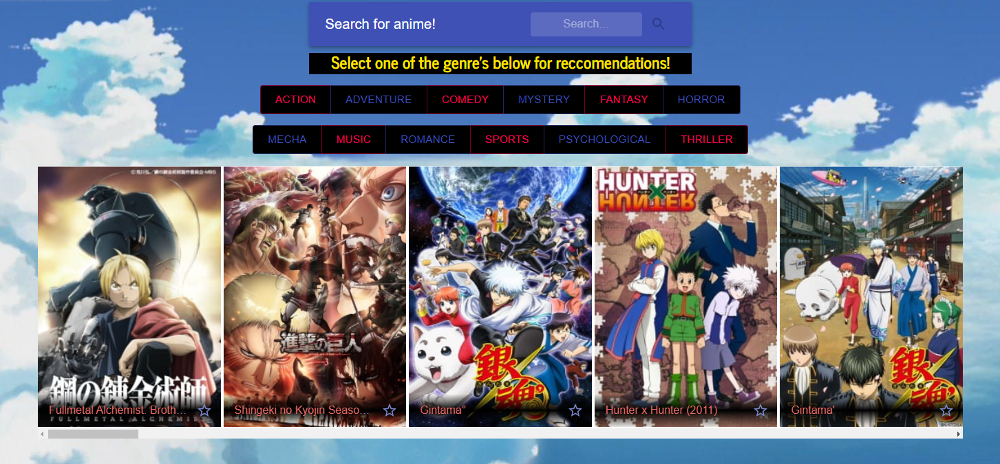

# Ani-Gate

## Description
This is a full stack application built using the MERN stack. It uses the unofficial MAL API provided by JIKAN to retrieve data about anime from MyAnimeList. This app allows users to search different anime genre's and get a list of reccomended results that can then be saved to the favorites page. Users also have the ability to search for anime by name and get a list of all the series or seasons related to that title.

## Table of Contents
* [Technologies](#Technologies)
* [Usage](#Usage)
* [Demonstration](#Demonstration)
* [License](#License)
* [Questions](#Questions)

## Technologies
* Express
* HTML
* SASS
* Javascript
* Material UI
* node.js
* passport.js
* MongoDB
* Mongoose
* Jikan API
* React
* Axios

## Usage
To use the app you need to sign up with an email and password to get access to the rest of the site. Once you are signed in, you can use the genre buttons or the search bar to make GET requests to the JIKAN API and get a list of anime that match what you searched for. You can click the star at the bottom of each anime card to save that anime to the favorites page, and use the delete button on your saved cards to remove them from the page and database.

### Deployed application link - https://wheres-my-waifu.herokuapp.com/

## Jikan API - https://jikan.moe/

## Demonstration

## License
MIT License - Copyright 2021 Patrick-Kaczmar

    Permission is hereby granted, free of charge, to any person obtaining a copy of this software and associated documentation files (the "Software"), to deal in the Software without restriction, including without limitation the rights to use, copy, modify, merge, publish, distribute, sublicense, and/or sell copies of the Software, and to permit persons to whom the Software is furnished to do so, subject to the following conditions:
    
    The above copyright notice and this permission notice shall be included in all copies or substantial portions of the Software.
    
    THE SOFTWARE IS PROVIDED "AS IS", WITHOUT WARRANTY OF ANY KIND, EXPRESS OR IMPLIED, INCLUDING BUT NOT LIMITED TO THE WARRANTIES OF MERCHANTABILITY, FITNESS FOR A PARTICULAR PURPOSE AND NONINFRINGEMENT. IN NO EVENT SHALL THE AUTHORS OR COPYRIGHT HOLDERS BE LIABLE FOR ANY CLAIM, DAMAGES OR OTHER LIABILITY, WHETHER IN AN ACTION OF CONTRACT, TORT OR OTHERWISE, ARISING FROM, OUT OF OR IN CONNECTION WITH THE SOFTWARE OR THE USE OR OTHER DEALINGS IN THE SOFTWARE.

## Questions
Patrick-Kaczmar's GitHub profile - https://github.com/Patrick-Kaczmar

If there are any additional questions about this repository please contact me at pk1blue@yahoo.com
